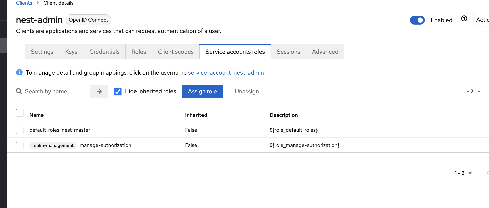
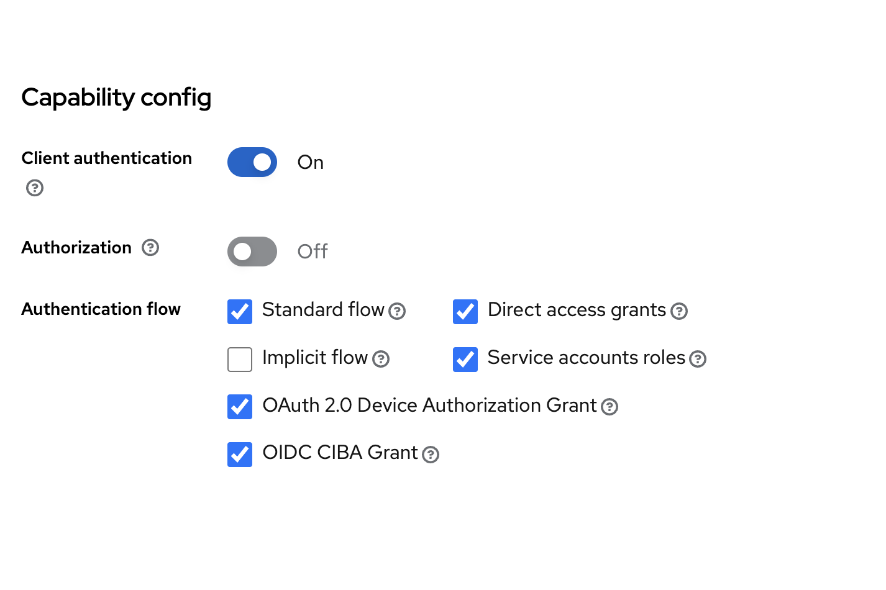
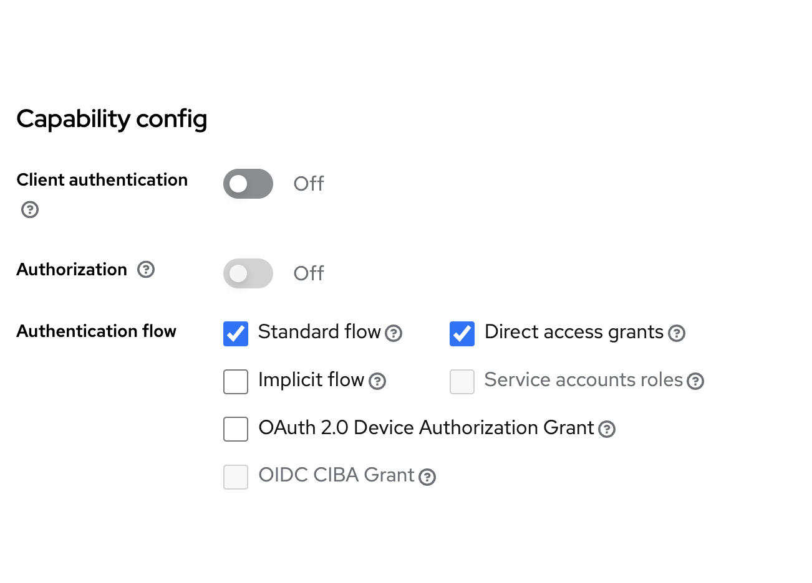
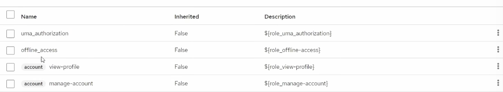
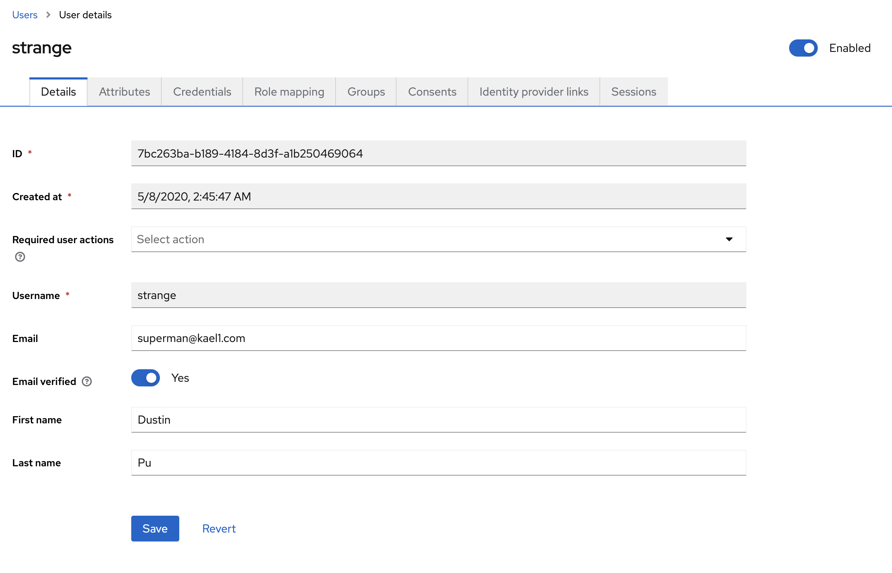

# REFERENCES:

# DOCKER:

- https://github.com/cryoutsolutions/angular-nestjs/blob/master/docker-compose.yml

# KeyCloak

- Identity Federation and Single Sign-On (SSO)
- https://medium.com/devops-dudes/secure-nestjs-rest-api-with-keycloak-745ef32a2370

# Admin

 

# Client

# User

# Postman

- Access and get Users https://www.youtube.com/watch?v=lfBYdN79M9c

- Create two client for user and for admin (and use postman to access them)

https://github.dev/ndeitch/nestjs-keycloak/blob/master/src/decorator/strategy/keycloak.strategy.ts
